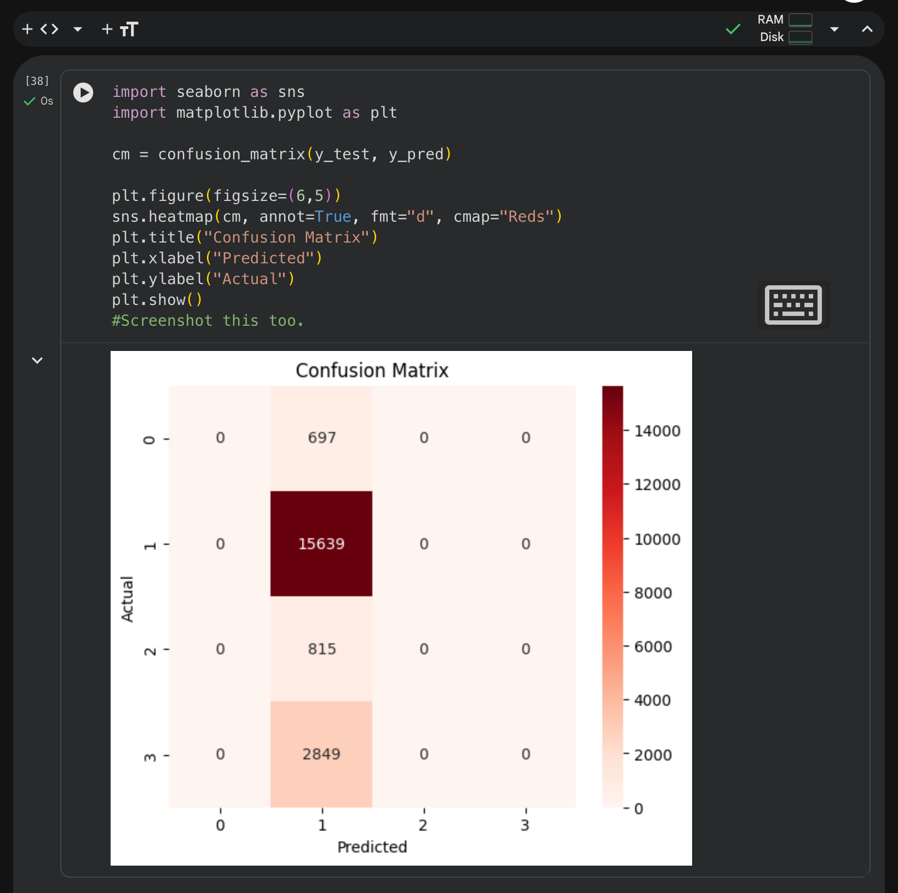
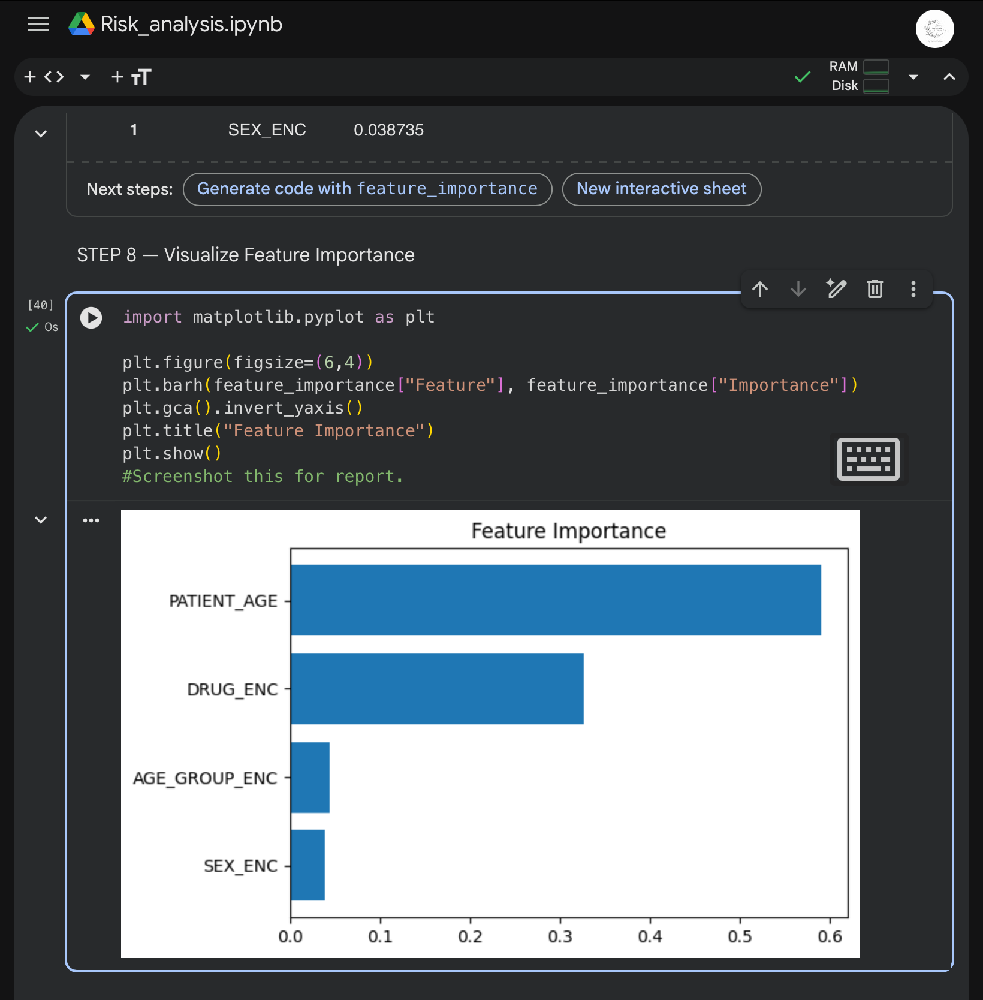
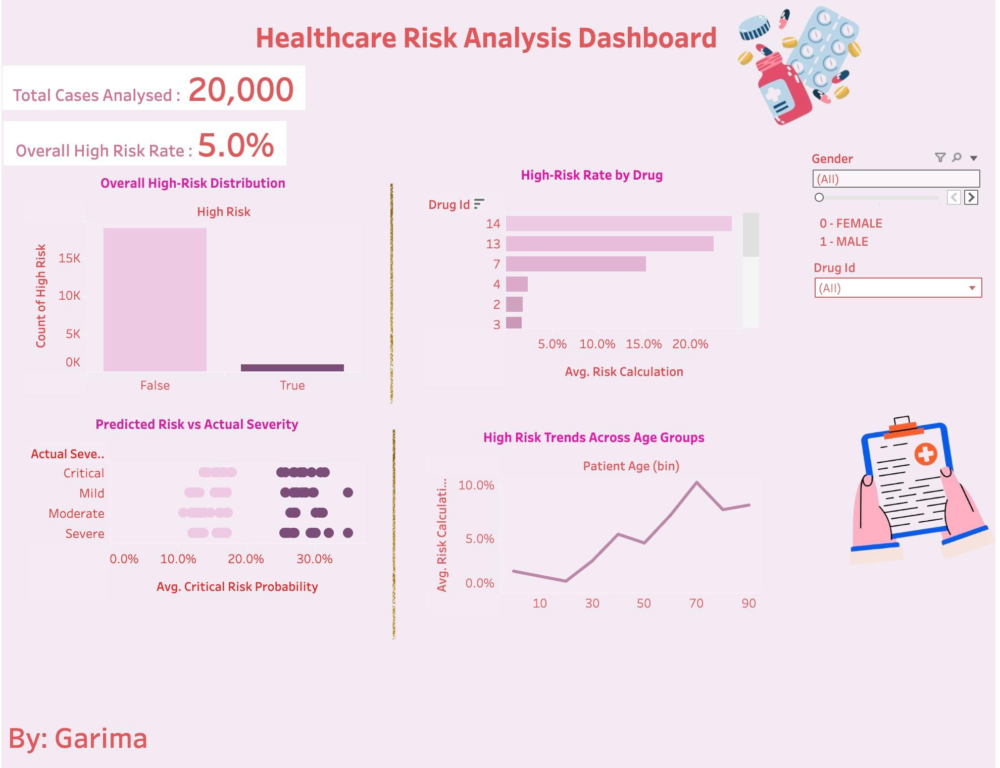

# 🏥 Enterprise Pharmacovigilance Risk Intelligence System

### TCS iON AIP-225 Industry Project

Machine learning pipeline for pharmacovigilance risk analysis, structured data validation, feature engineering, severity prediction, and executive dashboard development.

---

## 📌 About the Project

This project simulates an enterprise pharmacovigilance environment where adverse drug reaction (ADR) data is:

- Validated using governance rules  
- Standardized into severity categories  
- Modeled using machine learning  
- Visualized through executive dashboards  

Objective: Convert raw ADR records into structured risk intelligence.

---

## 🎯 Problem Statement

Design a system capable of:

- Ensuring ADR data quality  
- Predicting severity levels  
- Identifying high-risk drugs and demographics  
- Supporting safety signal detection  

---

## ✨ Key Features

| Feature | Description |
|----------|-------------|
| Data Governance | Missing value checks, validation rules |
| Severity Modeling | Multi-class classification |
| Random Forest Model | Ensemble-based risk prediction |
| Feature Importance | Interpretability support |
| Tableau Dashboard | Executive risk monitoring |
| Risk Escalation Rule | High-risk probability flagging |

---

## 🏗 Architecture
ADR Dataset

↓

Data Cleaning & Validation

↓

Feature Engineering

↓

Train-Test Split (80:20)

↓

Random Forest Model

↓

Evaluation Metrics

↓

Tableau Dashboard

---

## 🛠 Tech Stack

**Machine Learning**
- Python
- Pandas
- NumPy
- Scikit-learn
- Matplotlib
- Seaborn

**Platform**
- Google Colab

**Visualization**
- Tableau Public

---

## 📂 Project Structure
Enterprise-Healthcare-Risk-Intelligence-System/

│

├── Risk_analysis.ipynb

├── README.md

└── screenshots/

├── severity_distribution.png

├── confusion_matrix.png

├── tableau_dashboard.png

---

## 📸 Visual Outputs

### 🎯 Classification Accuracy

---

### 🔎 Confusion Matrix

---

### 📈 Feature Importance (Random Forest)

---

### 📊 Tableau Dashboard Preview

---

## 📊 Model Performance

**Model:** Random Forest  
n_estimators = 150  
max_depth = 12  

### Performance Metrics

- Accuracy: 78.2%
- Macro F1-Score: 0.22
- Weighted F1-Score: 0.69

### Key Observation

The model performs strongly on the dominant severity class but shows reduced sensitivity for minority classes due to class imbalance.

---

## 📈 Tableau Dashboard

Interactive dashboard includes:

- Severity distribution  
- High-risk rate by drug  
- Risk trend across age groups  
- Predicted vs actual severity  

🔗 Tableau Link: https://public.tableau.com/app/profile/garima3548/vizzes

---

## ▶ Getting Started

1. Clone repository  
2. Open notebook in Google Colab  
3. Upload dataset  
4. Run all cells  

---

## 👩‍💻 Author

Garima  
TCS iON AIP-225 Intern
